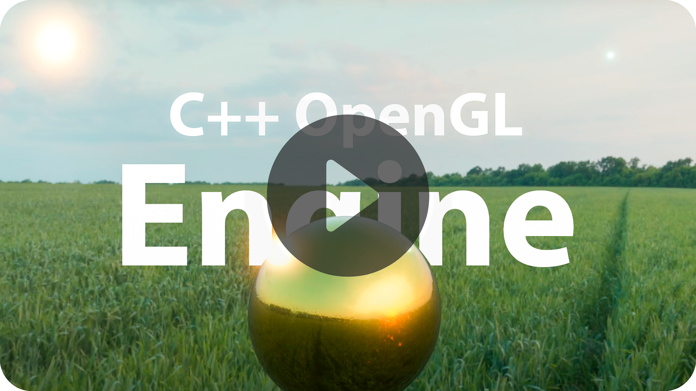

<h1><strong>Chotra Engine - Custom real-time rendering engine </strong></h1>   
 
<h3><strong>C++, OpenGL, GLFW, GLM, ImGui, 
OBJ-model loading, PBR (Metallic workflow), Lighting, Image Based Lighting, 
Gamma correction, Post-processing, Multisampling, Bloom ... </strong></h3>

 

Hi. I'm Igor.

First of all, I'd like to express my deep gratitude to the people who are tirelessly providing educational materials for computer graphics programming. These materials allow both beginners and professionals to improve their skills.

The models for my small projects are kindly supplied by my eldest son Dmitry (a great fan of 3D modeling).

I hope my skills will improve soon and my projects will get better, they will have shadows, skeletal animation and many other effects.

I'd like to meet and talk with professionals in this workspace. I hope to receive feedbacks and guidances.

Regards,  Igor Uzun.

 
<h3><strong>My contacts:</strong></h3>

<a href="mailto:igordmitriev@gmail.com">igordmitriev.uzun@gmail.com</a>

<a href="https://www.linkedin.com/in/igor-uzun">LinkedIn</a>

<a href="https://www.github.com/Uzunig">GitHub</a>

